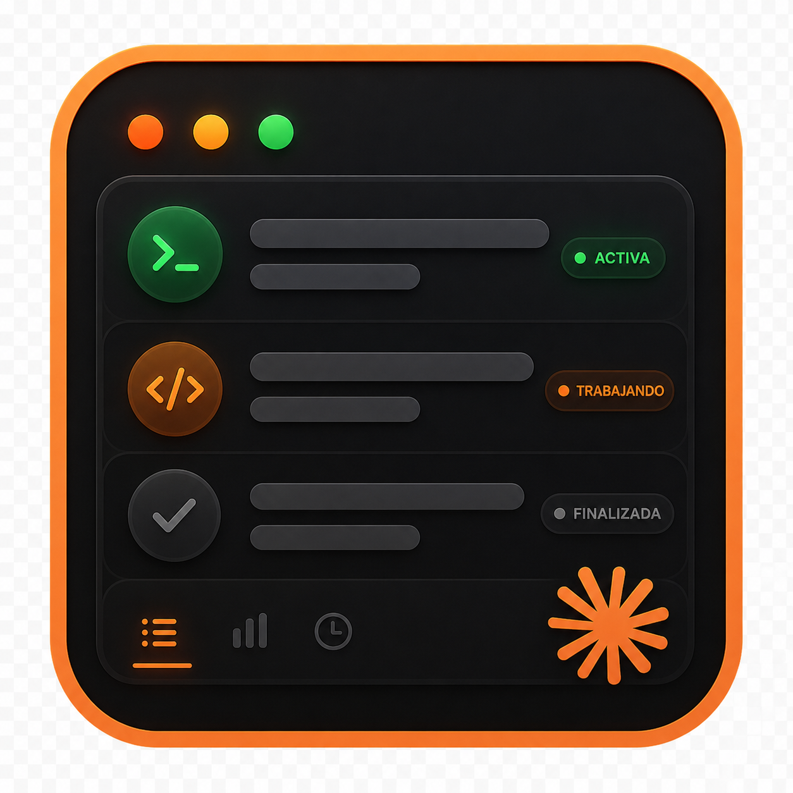

<div align="center">



# Claude Notch

**Tu notch del MacBook como Dynamic Island para Claude Code.**

[](LICENSE)
[]()
[]()

</div>

App nativa de macOS que muestra todas tus sesiones de Claude Code en un panel
flotante con efecto liquid glass. Aprovecha el notch del MacBook como Dynamic
Island: una pastilla discreta arriba que se expande al pasar el cursor para
mostrar qué hay corriendo, en qué directorio, y cuánto lleva.

Si tu Mac no tiene notch, la app cae a una ventana flotante en la esquina que
elijas — todo el resto funciona igual.

> Compañera nativa de [`claude-code-notifier`](https://github.com/arratiabenjamin/claude-code-notifier).
> Lee el archivo `~/.claude/active-sessions.json` que ese repo escribe vía hooks
> y lo renderiza con SwiftUI + `NSVisualEffectView` para el look real de Control Center
> que los widgets web no pueden alcanzar.

## Qué hace

- **Pastilla en el notch.** Logo + contador de sesiones activas, pegado al cutout
  del hardware. Punto amarillo si algo está corriendo, verde si está idle.
- **Expansión al hover.** Pasás el cursor por arriba del notch y la pastilla se
  morfea hacia abajo en un panel completo con cada sesión: nombre, estado,
  directorio, duración del último turno. Si dejás de mover el cursor por 3 s,
  vuelve sola al modo compacto.
- **Acciones por sesión.** Click en una fila la expande inline con el último
  fragmento del transcript (live tail vía FSEvents, sin polling). Botones para
  **Reveal** en Finder, **Terminal** (te lleva exactamente a la app — Ghostty,
  iTerm2, Warp, WezTerm, kitty, alacritty, Hyper, Tabby o Terminal.app — donde
  vive la sesión, no abre una nueva), y **End session** que envía SIGINT al
  pid para un cierre limpio.
- **Notificaciones inteligentes.** Te avisa cuando un turno largo terminó (tu
  umbral configurable, por defecto 90 s) y cuando hay múltiples sesiones
  activas en paralelo. El permiso de notificaciones se pide cuando hace falta,
  no al arranque.
- **Renombrar sesiones.** Si usás `/rename` dentro de Claude Code, el nombre
  aparece en tiempo real en el panel — la app vigila `~/.claude/sessions/`.
- **Toggle en vivo notch ↔ ventana.** Botón en el header del panel para cambiar
  entre Dynamic Island y ventana flotante sin abrir Settings. Si tu Mac no
  tiene notch, el botón ni aparece.
- **Cierre instantáneo.** Cuando terminás una sesión con el botón End session,
  desaparece del panel al instante — no pasa por una sección "Recently".

## Compatibilidad

- macOS 14 (Sonoma) o superior. Probado a fondo en macOS 26 Tahoe (M4 14" MacBook Pro).
- Detección de notch automática para MacBook Pro 14"/16" 2021+ y MacBook Air 2022+.
- Read-only: nunca escribe sobre `active-sessions.json`. Ese archivo es
  responsabilidad exclusiva de `claude-code-notifier` (los hooks).

## Instalación

1. Cloná este repo y compilá (ver más abajo) o descargá el `.app` desde la
   última [release](https://github.com/arratiabenjamin/claude-notch/releases).
2. Movelo a `/Applications/`.
3. Abrilo. Vive en la barra de menú con el icono ◆.
4. Configurá [`claude-code-notifier`](https://github.com/arratiabenjamin/claude-code-notifier)
   para que las sesiones se registren en `~/.claude/active-sessions.json`.

## Compilación

Requiere Xcode 16+ y [XcodeGen](https://github.com/yonaskolb/XcodeGen).

```bash
brew install xcodegen
xcodegen generate
open ClaudeNotch.xcodeproj
# Cmd+R para compilar y correr
```

El `.xcodeproj` se regenera desde `project.yml` — ese archivo es la fuente de
verdad. No commitees el `.xcodeproj`.

Para una build rápida desde terminal:

```bash
xcodebuild -scheme ClaudeNotch -configuration Debug build
```

## Arquitectura

Clean architecture mínima sobre cuatro capas:

```
Sources/ClaudeNotch/
├── App/             # NSApplicationDelegate, ciclo de vida del panel
├── Domain/          # SessionState, SessionStore, UIState machine
├── Infrastructure/  # FSEvents, Dispatch, AppleScript, kill(), URLSession
└── Presentation/    # SwiftUI views, NSPanel subclass, NotchDetector
```

Concurrencia bajo Swift 6 strict mode. El bridge entre el callback C de FSEvents
y el `@MainActor SessionStore` se hace con `@unchecked Sendable` + Combine
PassthroughSubject + AsyncStream — sin warnings y sin condiciones de carrera.

## Tests

```bash
xcodebuild -scheme ClaudeNotch -configuration Debug test
```

23 tests cubriendo la lógica pura: decode tolerante a schema, fallbacks de
nombre, parser de transcript, desambiguación de duplicados, geometría del notch.

## Por qué un repo separado

`claude-code-notifier` es dueño de los hooks (backend) y escribe el state file.
`claude-notch` es uno de los front-ends (UI). El state file es el contrato. Cada
componente evoluciona por su lado.

## Licencia

MIT — ver [LICENSE](LICENSE).

## Hecho por

Construido por [Benjamín Arratia](https://github.com/arratiabenjamin) en
[Velion](https://github.com/arratiabenjamin) — un estudio de software de una
sola persona.
